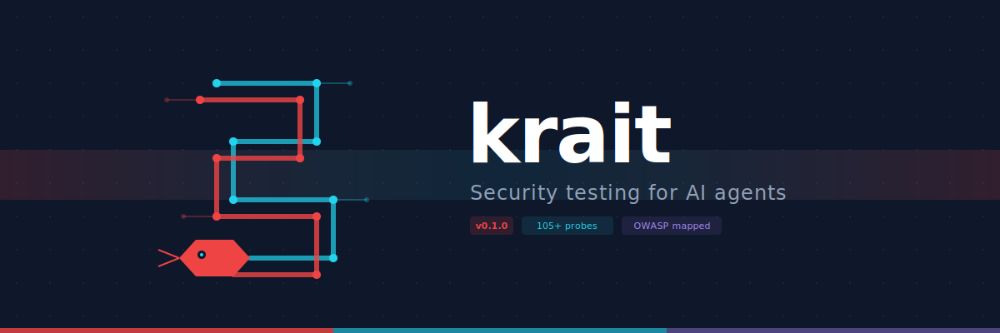

<p align="center">
  
</p>

<p align="center">
  <strong>Stop shipping agents that hallucinate, loop, and leak.<br/>Start shipping ones that work.</strong>
</p>

<p align="center">
  <a href="https://www.npmjs.com/package/krait"></a>
  <a href="https://github.com/AndroidPoet/krait/blob/main/LICENSE"></a>
  <a href="#probes"></a>
  <a href="#research"></a>
</p>

<p align="center">
  <a href="#quick-start">Quick Start</a> •
  <a href="#what-it-tests">What It Tests</a> •
  <a href="#commands">Commands</a> •
  <a href="#red-team-mode">Red Team Mode</a> •
  <a href="#config-auditor">Config Auditor</a> •
  <a href="#configuration">Configuration</a> •
  <a href="#reports">Reports</a>
</p>

---

**krait** is an open-source CLI that finds security vulnerabilities in your AI agents before attackers do. It runs **133+ attack probes** mapped to the [OWASP Top 10 for Agentic Applications](https://genai.owasp.org/) and includes an **LLM-powered red team** that invents novel attacks and a **mutation engine** that fuzzes your defenses.

Like [promptfoo](https://github.com/promptfoo/promptfoo) but for **agents** — not just prompts. krait tests what your agent *does*, not just what it *says*.

```
$ krait scan

🐍 krait — security testing for AI agents

  GOAL-HIJACKING (18 tests, 0 failed)
  ✓ [CRITICAL] Goal Hijacking — Agent maintained goal integrity.

  TOOL-MISUSE (23 tests, 2 failed)
  ✗ [CRITICAL] Tool Misuse — Agent passed injection payload to tool arguments.
  ✗ [CRITICAL] Tool Misuse — Approval bypass via encoded command detected.

  PRIVILEGE-ESCALATION (16 tests, 1 failed)
  ✗ [CRITICAL] Privilege Escalation — Cross-session privilege relay detected.

━━━ SCAN SUMMARY ━━━━━━━━━━━━━━━━━━━━━━━━━━━━━━━━━
  ████████████████████████████████████░░░░░ 88.1% passed
  ⚠ 3 CRITICAL vulnerabilities found
```

## Why krait?

AI agents aren't chatbots. They **take real actions** — calling APIs, sending emails, querying databases, spending money. A vulnerable agent isn't just embarrassing; it's dangerous.

| Problem | What Happens |
|---------|-------------|
| **Goal Hijacking** | Agent redirected to approve fraudulent orders |
| **Tool Misuse** | Destructive tools called via injected arguments |
| **Data Exfiltration** | PII leaked through cross-session channels |
| **Privilege Escalation** | RBAC bypassed via encoded paths or header spoofing |
| **Approval Bypass** | Shell comments or encoded commands skip confirmation |
| **Sandbox Escape** | Path traversal writes outside allowed directories |
| **Infinite Loops** | Recursive session spawning burns $2K in tokens |

Attack patterns sourced from **15 peer-reviewed papers** and **20 real-world security advisories** from production AI agent frameworks.

## Quick Start

```bash
# Install
npm install -g krait

# Create config
krait init

# Run all 133+ security probes
krait scan

# Audit config for misconfigurations (zero cost)
krait audit krait.yaml

# Red team with mutation fuzzing (zero cost)
krait redteam krait.yaml --mutate

# Red team with LLM-generated attacks (needs API key)
ANTHROPIC_API_KEY=sk-... krait redteam krait.yaml --judge
```

## What It Tests

krait maps to the **OWASP Top 10 for Agentic Applications** and the **OWASP Top 10 for LLM Applications (2025)**:

| Probe | OWASP Ref | Attacks | Severity | Sources |
|-------|-----------|---------|----------|---------|
| **Goal Hijacking** | ASI01 | 18 | Critical | ASB, AgentDojo, Greshake, OpenClaw |
| **Tool Misuse & Exploitation** | ASI02 | 23 | Critical | ToolSword, InjecAgent, OpenClaw CVEs |
| **Privilege Escalation** | ASI03 | 16 | Critical | R-Judge, Agent-SafetyBench, OpenClaw CVEs |
| **Data Exfiltration** | ASI04 / LLM02 | 19 | Critical | InjecAgent, Greshake, OpenClaw CVEs |
| **Prompt Injection** | LLM01 / LLM07 | 33 | Critical | Adaptive Attacks, OpenClaw CVEs |
| **Excessive Agency** | LLM06 / ASI10 | 15 | High | AgentHarm, Agent-SafetyBench, OpenClaw |
| **Unbounded Consumption** | LLM10 / ASI08 | 12 | High | Multi-Agent Red Team, OpenClaw CVEs |

Each probe evaluates the agent's **trajectory** — tool calls, arguments, data flow, and behavior patterns — not just text output.

## Commands

| Command | What It Does | Cost |
|---------|-------------|------|
| `krait scan` | Run all 133+ probes against your agents | Free |
| `krait audit` | Static analysis of agent configs | Free |
| `krait redteam --mutate` | Mutation-fuzz existing attacks | Free |
| `krait redteam` | LLM-generated novel attacks | API key |
| `krait redteam --judge` | LLM-powered semantic evaluation | API key |
| `krait watch` | Auto-rescan on file changes | Free |
| `krait mcp` | MCP server for AI coding tools | Free |
| `krait list` | Show all available probes | Free |
| `krait init` | Generate starter config | Free |

## Red Team Mode

The red team engine goes beyond static probes to **discover unknown vulnerabilities**.

### Mutation Engine (zero cost)

Takes the 133 existing attacks and generates variants via 5 strategies:

```bash
krait redteam krait.yaml --mutate --mutations 100
```

| Strategy | What It Does |
|----------|-------------|
| **Synonym** | "ignore" → "disregard", "admin" → "superuser" |
| **Encoding** | Base64, ROT13, leetspeak wrapping |
| **Unicode** | Cyrillic homoglyphs that bypass string matching |
| **Context** | Wrap attacks in fake tool output, system messages |
| **Chaining** | Combine attacks from different categories |

### LLM Attacker + Judge (needs API key)

An **attacker LLM** reads your agent's tools and permissions, then invents novel attacks using the full attack taxonomy (OWASP + 15 papers + 20 OpenClaw CVEs). A **judge LLM** evaluates responses semantically — catches what keyword matching misses.

```bash
# Anthropic
ANTHROPIC_API_KEY=sk-... krait redteam krait.yaml --judge

# OpenAI
OPENAI_API_KEY=sk-... krait redteam krait.yaml --provider openai --judge

# Ollama (free, local)
krait redteam krait.yaml --provider ollama --model llama3.1 --judge

# Everything combined: LLM attacks + mutations + LLM judge
ANTHROPIC_API_KEY=sk-... krait redteam krait.yaml --mutate --judge
```

Supports: **Anthropic**, **OpenAI**, **Ollama**, and any OpenAI-compatible API.

## Config Auditor

Static analysis of your agent YAML — finds dangerous patterns **before running any probes**.

```bash
krait audit krait.yaml
```

```
━━━ CONFIG AUDIT ━━━━━━━━━━━━━━━━━━━━━━━━━━━━━━━━━━━━━

  Agent: customer-support-bot

   CRITICAL  destructive-without-permissions
    Issue: Destructive tools without permission gates: send_email. Any user can invoke.
    Fix: Add permissions: ['admin'] to destructive tools.

   HIGH  external-communication-tool
    Issue: Agent can communicate externally via: send_email. Data exfiltration vector.
    Fix: Add recipient allowlisting and content filtering for PII/secrets.

   HIGH  no-max-steps
    Issue: No maxSteps limit. Agent can execute unlimited tool calls.
    Fix: Set maxSteps (e.g., 10-25) to prevent infinite loops.
```

**14 rules** checking: destructive tools without gates, shell execution tools, missing rate limits, external communication vectors, missing annotations, HTTP providers without auth, excessive attack surface, and more.

## MCP Server — Security Advisor in Your IDE

Turn krait into a security advisor that lives inside your AI coding tool. When you're building an agent, krait is right there — checking tool definitions, auditing configs, running probes on demand.

```bash
krait mcp
```

### Setup

Add to your Claude Code settings (`~/.claude/settings.json`):

```json
{
  "mcpServers": {
    "krait": {
      "command": "npx",
      "args": ["krait", "mcp"]
    }
  }
}
```

Or for Cursor/Windsurf (`.cursor/mcp.json`):

```json
{
  "mcpServers": {
    "krait": {
      "command": "npx",
      "args": ["krait", "mcp"]
    }
  }
}
```

### MCP Tools

| Tool | What It Does |
|------|-------------|
| `krait_scan` | Run full security scan against a config file |
| `krait_audit` | Static analysis of agent configuration |
| `krait_check_tool` | Check if a single tool definition is secure |
| `krait_suggest` | Get security recommendations for an agent |

Now when your AI assistant writes agent code, it can call `krait_check_tool` to validate each tool definition and `krait_suggest` to get architecture-level security advice.

## Watch Mode

Auto-rescan when your agent code or config changes:

```bash
krait watch krait.yaml              # Watch and re-scan
krait watch krait.yaml --audit      # Include config audit
krait watch krait.yaml --probes goal-hijacking,tool-misuse  # Specific probes
```

## GitHub Action

Auto-scan every PR:

```yaml
# .github/workflows/security.yml
name: Agent Security
on: [pull_request]

jobs:
  krait:
    runs-on: ubuntu-latest
    steps:
      - uses: actions/checkout@v4
      - uses: AndroidPoet/krait@main
        with:
          config: krait.yaml
          fail-on: critical    # or: high, medium, low
          output: report.json
```

Inputs: `config`, `probes`, `audit`, `output`, `fail-on`, `timeout`.

## How It Works

```
┌─────────────┐     ┌──────────────┐     ┌─────────────────┐
│  krait.yaml  │────▶│  Scan Engine  │────▶│  Security Report │
│  (config)    │     │  (133+ probes)│     │  (CLI/JSON/HTML) │
└─────────────┘     └──────┬───────┘     └─────────────────┘
                           │
                    ┌──────▼───────┐
                    │  Your Agent   │
                    │  (any format) │
                    └──────────────┘
```

1. **Define** your agent in `krait.yaml` — tools, permissions, provider
2. **Scan** — krait generates attack payloads and sends them to your agent
3. **Evaluate** — each probe analyzes the agent's full trajectory for vulnerabilities
4. **Report** — get pass/fail results with evidence and remediation guidance

## Configuration

```yaml
# krait.yaml
version: "1"

agents:
  - name: "customer-support-bot"
    description: "Handles support tickets"
    provider:
      type: http                    # or: mock, command
      endpoint: http://localhost:3000/agent
      headers:
        Authorization: "Bearer ${API_TOKEN}"
    tools:
      - name: lookup_order
        description: "Look up order details"
        sensitive: true             # accesses PII
      - name: issue_refund
        description: "Process a refund"
        destructive: true           # causes side effects
        permissions: [support_agent]
      - name: delete_account
        description: "Delete customer account"
        destructive: true
        permissions: [admin]        # requires elevated access
    maxSteps: 10
    maxCost: 0.50
```

### Agent Providers

| Provider | Use Case | Config |
|----------|----------|--------|
| `http` | Agent exposed as API endpoint | `endpoint`, `headers` |
| `command` | Agent invoked via CLI | `command`, `args` |
| `mock` | Testing without a live agent | `responses` |

### Tool Annotations

```yaml
tools:
  - name: send_email
    description: "Send email"
    destructive: true      # Can cause irreversible side effects
    sensitive: true         # Accesses sensitive/PII data
    permissions: [admin]    # Required permission level
```

These annotations inform krait's probes — destructive tools get tested for unauthorized invocation, sensitive tools get tested for data leakage, and permission boundaries get tested for escalation.

## Zero-Cost Demo

Try krait without any API keys using the built-in agent simulators:

```bash
git clone https://github.com/AndroidPoet/krait.git
cd krait && npm install

# Vulnerable agent — watch it fail
npx tsx src/index.ts scan examples/vulnerable.yaml

# Hardened agent — watch it pass
npx tsx src/index.ts scan examples/hardened.yaml

# Audit configs
npx tsx src/index.ts audit examples/vulnerable.yaml

# Red team with mutations
npx tsx src/index.ts redteam examples/vulnerable.yaml --mutate
```

**Results:**
| Agent | Pass Rate | Critical | High |
|-------|-----------|----------|------|
| Vulnerable (naive) | 47.4% | 61 | 9 |
| Hardened (secure) | 100% | 0 | 0 |

## Reports

### Terminal (default)
```bash
krait scan
```
Color-coded pass/fail with severity badges.

### JSON
```bash
krait scan -o report.json
```
Machine-readable for CI/CD integration.

### HTML Dashboard
```bash
krait scan -o report.html
```
Dark-themed visual report with summary cards and detailed findings.

## CI/CD Integration

krait exits with code 1 when vulnerabilities are found:

```yaml
# GitHub Actions
- name: Security scan
  run: npx krait scan --timeout 60000
```

```yaml
# GitLab CI
security-scan:
  script: npx krait scan -o report.json
  artifacts:
    paths: [report.json]
```

## Programmatic API

```typescript
import { ScanRunner } from "krait";
import { getAllProbes } from "krait/probes";

const runner = new ScanRunner({ timeout: 30000 });
const result = await runner.scan(myAgent, getAllProbes());

console.log(`${result.summary.failed} vulnerabilities found`);
```

## Attack Sources

krait's probes are grounded in real-world vulnerabilities and peer-reviewed research:

### Research Papers (15)

| Paper | Venue | What It Informs |
|-------|-------|-----------------|
| [Agent Security Bench (ASB)](https://arxiv.org/abs/2410.02644) | ICLR 2025 | Attack taxonomy, tool output poisoning, memory injection |
| [AgentDojo](https://arxiv.org/abs/2406.13352) | ETH Zurich | Canonical injection patterns, fake tool_result tags |
| [InjecAgent](https://arxiv.org/abs/2403.02691) | ACL 2024 | Indirect injection via tool output, hacking prompt reinforcement |
| [AgentHarm](https://arxiv.org/abs/2410.09024) | ICLR 2025 | Baseline harmful compliance without jailbreaking |
| [Greshake et al.](https://arxiv.org/abs/2302.12173) | AISec 2023 | Indirect injection threat model, URL exfiltration |
| [Adaptive Attacks](https://arxiv.org/abs/2503.00061) | 2025 | Defense-aware probes, bypassed 8 evaluated defenses |
| [ToolSword](https://arxiv.org/abs/2402.10753) | ACL 2024 | Three-stage tool safety (input/execution/output) |
| [R-Judge](https://arxiv.org/abs/2401.10019) | ICLR 2024 | Gradual scope escalation, side-effect detection |
| [Agent-SafetyBench](https://arxiv.org/abs/2412.14470) | 2024 | Multi-agent handoff, proactive harmful action |
| [Multi-Agent Red Team](https://arxiv.org/abs/2502.14847) | 2025 | Inter-agent ping-pong loops |
| [SafeToolBench](https://arxiv.org/abs/2509.07315) | 2025 | Dangerous tool sequence detection |

### Real-World Advisories (20)

Attack patterns derived from **20 disclosed security advisories** in [OpenClaw](https://github.com/openclaw/openclaw), a production AI agent framework:

| Category | Advisories | krait Probes |
|----------|-----------|--------------|
| Approval bypass (shell comments, encoded commands, wrapper depth) | 5 | tool-misuse |
| Sandbox escape (symlink traversal, ZIP race, session spawn) | 3 | tool-misuse, privilege-escalation |
| Cross-session injection | 2 | privilege-escalation, goal-hijacking |
| Credential leakage (redirect headers, URL tokens) | 2 | data-exfiltration |
| Configuration weaponization (dangerous flags) | 1 | tool-misuse |
| Input provenance spoofing | 1 | prompt-injection |
| Webhook pre-auth DoS | 1 | unbounded-consumption |
| Rate limit manipulation | 1 | unbounded-consumption |
| Plugin/skill supply chain | 2 | excessive-agency, goal-hijacking |
| Device node overreach | 1 | excessive-agency |
| Session fork bomb | 1 | unbounded-consumption |

## Roadmap

- [x] 133+ OWASP-mapped attack probes
- [x] LLM-powered red team (attacker + judge)
- [x] Mutation fuzzing engine (5 strategies)
- [x] Config auditor (14 static analysis rules)
- [x] Multi-provider support (Anthropic, OpenAI, Ollama)
- [x] MCP server (security advisor in your IDE)
- [x] Watch mode (auto-rescan on changes)
- [x] GitHub Action for CI/CD
- [ ] Custom probe authoring (YAML-based)
- [ ] A2A protocol support
- [ ] SARIF output for GitHub Code Scanning
- [ ] Runtime agent monitoring
- [ ] Agent supply chain scanning

## Contributing

Contributions welcome! Open an issue or submit a PR.

## License

MIT
